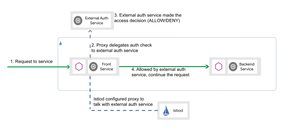
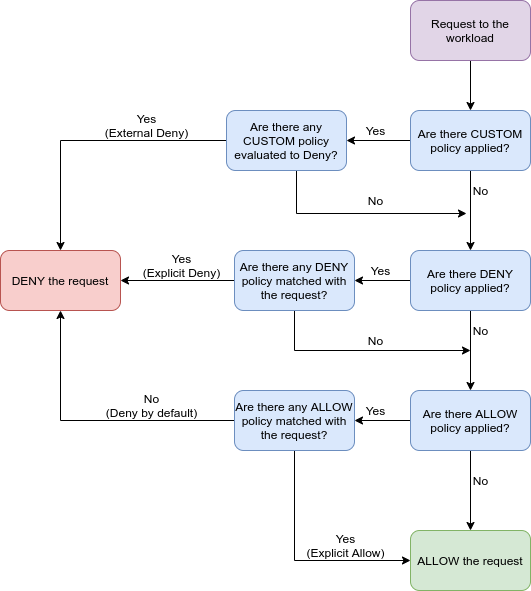

# Using Istio for authentication of services with Oauth2 Proxy

This repository contains example deployment which show how Istio service mesh can be used to setup OAuth2 Proxy authentication
in microservice architecture. 

[OAuth2 Proxy](https://oauth2-proxy.github.io/oauth2-proxy/) is a reverse proxy and static file server that provides authentication
using Providers (Google, GitHub, and others) to validate accounts by email, domain or group. It allows you to add OAuth2 flow
including redirect to authorization server to any HTTP service which is not capable of that itself.

Using OAuth2 Proxy as a sidecar to authenticate requests to services has some negative effects. It makes a deployment more
complicated and it causes problems with scaling (underutilization). The biggest advantage of approach using Istio in comparison
with traditional OAuth2 Proxy architecture is that you can use single scalable OAuth2 Proxy instance for all services in the
mesh.

# Using OAuth2 Proxy with Istio service mesh

Example of using [OAuth2 Proxy](https://oauth2-proxy.github.io/oauth2-proxy/) as extension provider with custom Istio
[AuthorizationPolicy](https://istio.io/latest/docs/reference/config/security/authorization-policy/).

Approach described in this example combines advantage of using OAuth2 Proxy for implementing OAuth2 flow and Istio service
mesh which completely handles cross-cutting concerns like authentication in microservice architecture. OAuth2 Proxy is deployed
as single (scalable) instance instead of repeating sidecar or proxy service for each pod.

Istio AuthorizationPolicy supports `CUSTOM` action which can be used for authentication or authorization by external
extension provider. If configured all request to the workload are routed to the provider which makes the authorization
decision. Istio also supports forwarding of new headers created by provider to upstream so it can send `Authrozation` token
or custom headers which can be used in upstream workloads.



By matching selector custom AuthorizationPolicy can be used:
* on ingress gateway service in Istio namespace to authenticate all external requests in cluster
* on specific workload in namespace (pod/VM)
* all workloads in namespace

Authorization policy with custom action is evaluated first. If provider returns any error code the request is denied. If
the rquest is accepted then allow and deny policies are applied. Allow policy can be then used for additional check of
JWT claims (e.g. Keycloak roles).



## Example deployment

Example Helm chart in this repository deploys following services:
* nginx - simple web server
* Keycloak - IAM with preconfigured OIDC client
* OAuth2 Proxy - used as extension provider for authenticating requests

Explanation of files in example:
* [istio-operator.yaml](istio-operator.yaml) - contains Istio mesh config with custom extension
provider which routes requests to service `istio-oauth2-proxy.test.svc.cluster.local`. Notice the headers configuration which
determines which headers will be forwarded to upstream.
* [templates/nginx/authorizationpolicy-oauth2.yaml](templates/nginx/authorizationpolicy-oauth2.yaml) - AuthorizationPolicy
which enables OAuth2 Proxy on nginx workload.
* [templates/nginx/authorizationpolicy-roles.yaml](templates/nginx/authorizationpolicy-roles.yaml) -
AuthorizationPolicy which ensures that JWT token contains role `test-role`.
* [templates/nginx/virtualservice.yaml](templates/nginx/virtualservice.yaml) - VirtualService with explicit routing to [OAuth2 Proxy endpoints](https://oauth2-proxy.github.io/oauth2-proxy/docs/features/endpoints) for direct requests to OAuth2 Proxy API.

## Requirements

If you would like to try examples on your own during the workshop you will need following tools:

* Kubernetes
* [Helm](https://helm.sh/docs/intro/install/)
* [K9s](https://k9scli.io/topics/install/)

## Install Kubernetes environment

Install any Kubernetes distribution on your local computer. Just follow the offcial documentation for installation. You may consider following:

* [Docker Desktop](https://docs.docker.com/desktop/) ([Windows](https://docs.docker.com/desktop/install/windows-install/), [Linux](https://docs.docker.com/desktop/install/linux-install/))
* [Minikube](https://minikube.sigs.k8s.io/docs/start/)

Enable Kubernetes in Docker Desktop following the [guide](https://docs.docker.com/desktop/kubernetes/).

Note that minikube does not support egress gateway and Docker Desktop ambient mesh. Ensure that your Kubernetes version is up-to-date (minimum 1.23).

## Install Helm

Linux

```
$ curl -fsSL -o get_helm.sh https://raw.githubusercontent.com/helm/helm/main/scripts/get-helm-3
$ chmod 700 get_helm.sh
$ ./get_helm.sh
```

You can find binaries for Windows in [GitHub repository](https://github.com/helm/helm/releases).

## Install Istio

Download the latest (alpha) Istio and istioctl tool:

```
$ curl -L https://istio.io/downloadIstio | ISTIO_VERSION=1.17.2 TARGET_ARCH=x86_64 sh -
$ cd istio-1.17.2
$ export PATH=$PWD/bin:$PATH
```

Then go to this cloned repository direcotry and install Istio into the cluster with custom configuration:

```
$ istioctl upgrade -f istio-operator.yaml -y
```

## Setup hosts

Add following records to `/etc/hosts` file on host system so we can use custom DNS names in out examples:

```
<IP> service.localhost
<IP> keycloak.localhost
```

Replace `<IP>` by IP address where your Kubernetes endpoints are available.

## Install examples

Create new namespace and enable istio sidecar injection:

```
$ kubectl create namespace workshop
$ kubectl label namespace workshop istio-injection=enabled --overwrite
```

Install Helm chart.

```
$ helm dependencies update
$ helm upgrade --install -n workshop istio .
```

## Try the example

Open the link [http://service.localhost:8080](http://service.localhost:8080) in browser. You will be automatically redirected
to Keycloak login page. You can then sign in as user *test* with password *123456*.